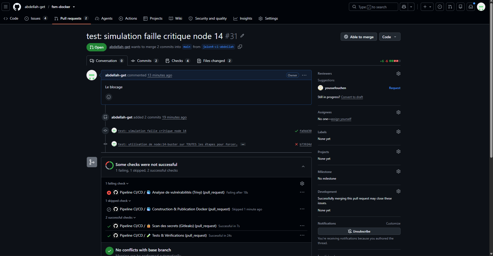
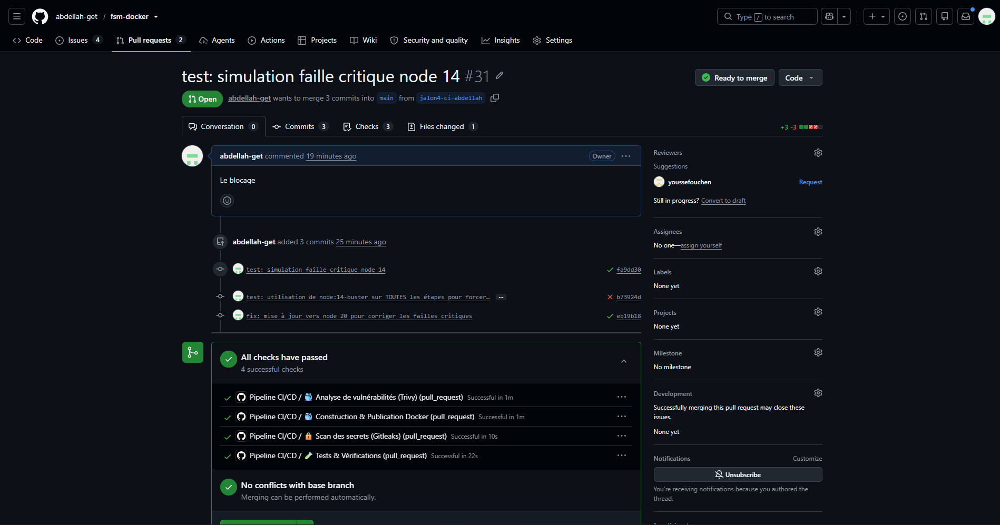
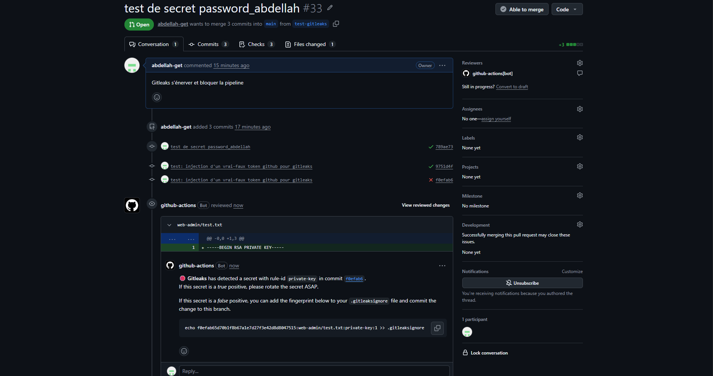
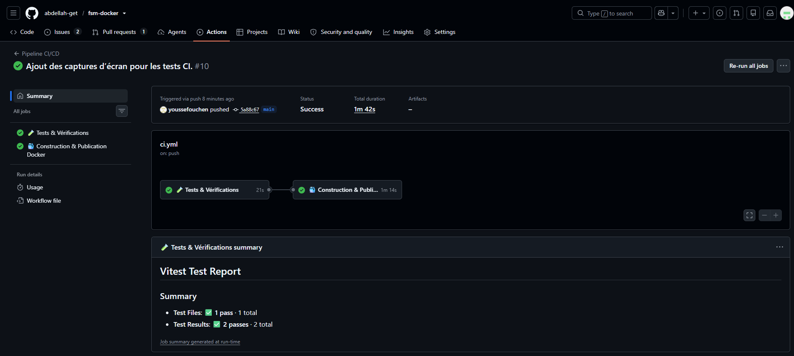
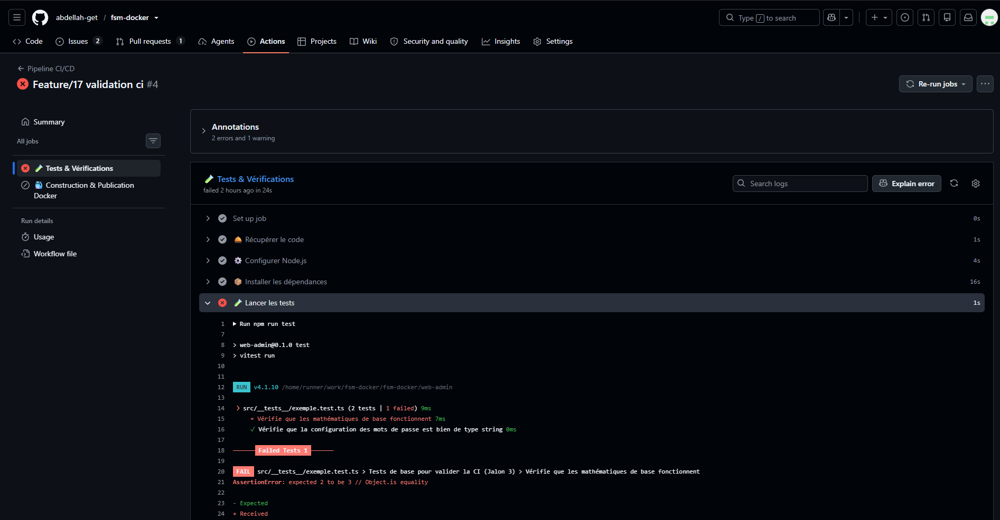
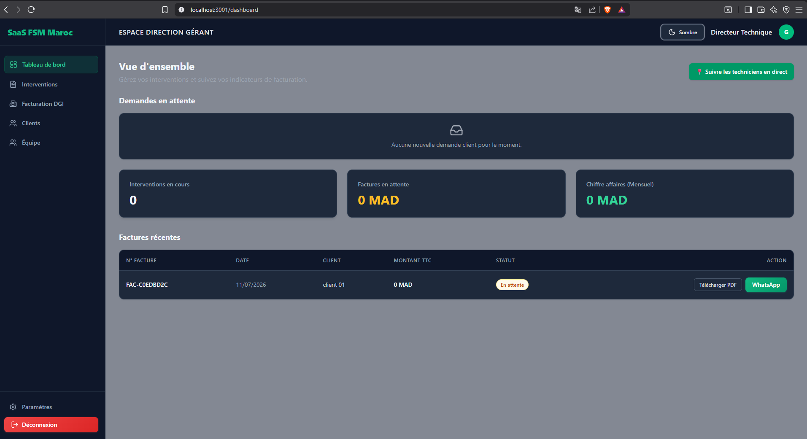
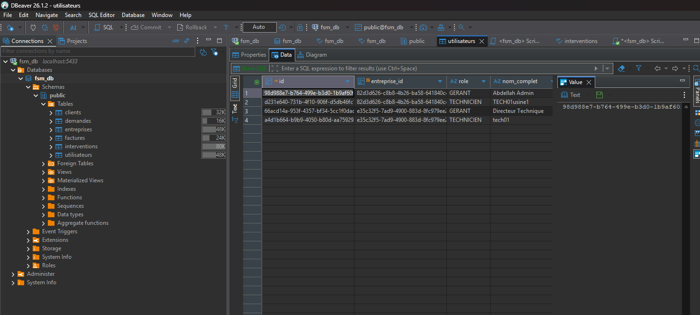

# JOURNAL DE BORD - STAGE Wilance (Abdellah ANECLOUB)

### Bilan du jalon 4 : Sécuriser la chaîne (DevSecOps)

**Dates :** 13 Juillet 2026

- **Objectif rappelé en une phrase :** Intégrer des contrôles de sécurité automatisés (scan de secrets et de vulnérabilités Docker) directement dans notre pipeline CI/CD pour empêcher le déploiement de code ou d'images dangereuses.

- **Ce que nous avons réalisé :**
  - **Côté Youssef :** Il a configuré l'outil Gitleaks pour scanner tout l'historique du dépôt à la recherche de mots de passe ou de clés API oubliés. Il a également ajouté l'étape de scan d'image Docker avec Trivy.
  - **De mon côté :** J'ai activé les garde-fous. J'ai configuré Trivy pour qu'il échoue strictement en cas de vulnérabilité `CRITICAL`. J'ai lié le job de construction Docker pour qu'il dépende du succès des scans de sécurité. J'ai ensuite prouvé que le pipeline jouait bien son rôle en le sabotant volontairement avec une vieille image pleine de failles (`node:14-buster`), avant de corriger le tir en repassant sur `node:20-alpine`.

- **Preuves (captures, journaux, liens) :**
  - **Lien du workflow CI final :** https://github.com/abdellah-get/fsm-docker/blob/main/.github/workflows/ci.yml
  - **Capture d'un blocage sur une vulnérabilité :** 
  - **Preuve de sa correction :** 
  - **Démonstration Gitleaks :** [Lien vers la PR ou capture de l'échec Gitleaks] 

- **Critères validés :**
  - [x] Le pipeline s'arrête bien sur une vulnérabilité critique.
  - [x] Un secret ajouté par erreur est détecté.
  - [x] Un rapport d'analyse est produit et consultable (dans les logs GitHub Actions).

- **Difficultés rencontrées et solutions :**
  - _Le piège du scanner intelligent :_ Lors de ma première simulation d'échec, Trivy laissait passer mon image `node:14-alpine` comme si elle était sécurisée. J'ai appris que Trivy ne scanne que l'image finale produite par le _multi-stage build_, et que les images Alpine sont souvent très propres. _Solution :_ Pour prouver le blocage, j'ai forcé l'utilisation d'une image Debian périmée (`node:14-buster`) sur toutes les étapes du `Dockerfile`, ce qui a parfaitement déclenché l'alerte critique.

- **Questions en attente :** Aucune pour le moment. Nous avons bien compris l'intérêt de la règle `fetch-depth: 0` pour Gitleaks (qui doit lire tout l'historique) et comment GitHub Actions gère les dépendances entre les jobs.

- **Temps passé et prochaines étapes :** Environ 1 jour de travail en binôme. La chaîne de développement est maintenant robuste et sécurisée. **Prochaine étape :** Le Jalon 5 pour faire sortir l'application de GitHub et la déployer sur le web !

## Le 13 Juillet 2026

- **Ce que j'ai fait :** Aujourd'hui, j'ai finalisé le Jalon 4 sur le DevSecOps. J'ai transformé les outils de sécurité mis en place par Youssef en véritables "bloqueurs". J'ai modifié le fichier `ci.yml` pour que Trivy fasse planter le pipeline (`exit-code: 1`) s'il trouve une faille `CRITICAL`. J'ai aussi ajouté la condition `needs` pour empêcher la publication Docker si la sécurité échoue. Enfin, j'ai simulé une faille en utilisant l'image `node:14-buster` pour prouver le blocage, puis j'ai corrigé avec `node:20-alpine`.
- **Ce qui me bloque :** Plus rien du tout ! J'ai eu un petit blocage au moment de tester la faille car Trivy ne détectait rien avec `node:14-alpine` (l'image finale était trop propre ou je ne modifiais pas la bonne étape du _multi-stage build_), mais le passage sur une image basée sur Debian (Buster) a très bien marché pour simuler l'alerte.
- **Ce que je vais faire ensuite :** Clôturer ce jalon, puis attaquer le Jalon 5 pour déployer notre application sur un vrai serveur.
- **Temps passé :** Environ 3 heures pour la configuration, les tests d'échec et les corrections.

---

### Bilan du jalon 3 : Automatiser les tests et la construction

**Dates :** 12 Juillet 2026

- **Objectif rappelé en une phrase :** Mettre en place un pipeline d'Intégration Continue (CI/CD) pour exécuter automatiquement nos tests et construire notre image Docker à chaque modification, afin de garantir que l'on ne fusionne jamais de code cassé.

- **Ce que nous avons réalisé :**
  - **Côté Yousef :** Il a posé d'excellentes fondations en créant le fichier de workflow GitHub Actions (`ci.yml`). Il a configuré l'installation de Node.js, le cache npm pour accélérer le processus, et a écrit le premier test unitaire "volontairement cassé" (1+1=3) pour vérifier que le pipeline bloquait bien en cas d'erreur.
  - **De mon côté :** J'ai finalisé l'intégration. J'ai remplacé les tests basiques par un vrai test de logique métier en créant une fonction de calcul de TVA (`calculs.ts`) pour tester l'application en conditions réelles. J'ai également finalisé la configuration pour que l'image Docker soit poussée sur le GitHub Container Registry (GHCR) uniquement lors d'une fusion sur la branche `main`. Enfin, j'ai généré et ajouté le badge de statut CI tout en haut de notre `README.md`.

- **Preuves (captures, journaux, liens) :**
  - **Lien du workflow :** https://github.com/abdellah-get/fsm-docker/actions
  - **Lien de l'image publiée :** https://github.com/abdellah-get/fsm-docker/pkgs/container/fsm-docker
  - **Capture d'une exécution réussie :** 
  - **Preuve de l'échec suivi de la correction :** 

- **Critères validés :**
  - [x] Une pull request déclenche le pipeline, et celui-ci passe au vert.
  - [x] Quand un test est cassé volontairement, le pipeline échoue.
  - [x] L'image Docker est bien publiée sur le registre GHCR.
  - [x] Le badge de statut est visible dans le README.

- **Difficultés rencontrées et solutions :**
  - **Le piège du navigateur :** Je voulais initialement tester notre fichier `pdfGenerator.ts`, mais je me suis rendu compte que la librairie PDF dépendait du navigateur. Lancer ce test sur les serveurs aveugles de GitHub aurait fait planter le pipeline. **Solution :** J'ai créé une fonction utilitaire (`calculs.ts`) purement algorithmique, facile et sûre à tester.
  - **Sécuriser la publication Docker :** Il fallait s'assurer que l'image ne se publie pas si le code est cassé. **Solution :** Nous avons bien compris et utilisé l'instruction `needs: test` dans notre fichier YAML pour créer une dépendance stricte entre les étapes.

- **Questions en attente :** Aucune pour l'instant.

- **Temps passé et prochaines étapes :** Environ 4h
  - **Prochaine étape :** puis attaquer le Jalon 4 :Sécuriser la chaîne.

## Le 12 Juillet

- **Ce que j'ai fait :** Finalisation de la partie CI/CD pour le Jalon 3 ! Mon binôme avait super bien préparé le terrain avec la structure du fichier ci.yml, donc je me suis concentré sur l'intégration finale. J'ai remplacé les tests basiques "bouche-trou" par de vrais tests unitaires liés à notre application. J'ai créé un fichier calculs.ts dans le dossier utils pour tester notre logique métier. J'ai aussi généré et intégré le badge de statut dynamique GitHub Actions au tout début de notre README.md. J'ai push tout ça proprement sur une nouvelle branche pour vérifier que tout fonctionne avant d'envoyer sur main.

- **Ce qui me bloque :** Plus rien, mais j'ai appris pas mal de choses ! Au début, je voulais écrire un test pour notre fichier pdfGenerator.ts, mais je me suis rendu compte que ça ferait planter les serveurs de GitHub Actions à coup sûr, car la génération de PDF a besoin d'un navigateur web pour fonctionner. Il a fallu ruser et créer une fonction métier plus isolée. J'ai aussi passé du temps à décortiquer le YAML pour comprendre la mécanique des pipelines, notamment le fameux verrou needs: test qui garantit que l'image Docker ne se construira jamais si le code est cassé.

- **Ce que je vais faire ensuite :** Ouvrir une Pull Request pour fusionner ma branche vers main. C'est ça qui déclenchera la vraie magie : je vais surveiller que le pipeline passe bien au vert, que mon badge sur le README se met à jour, et surtout, je vais aller récupérer le lien de notre image Docker qui sera automatiquement poussée sur le registre GHCR. Il ne restera plus qu'à réunir les liens et les captures pour le bilan.

- **Temps passé :** 2h (beaucoup d'exploration et de lecture pour bien comprendre les coulisses des serveurs GitHub Actions).

### Bilan du Jalon 2 : Mettre l'application dans des conteneurs

**Dates :** du 08 Juillet au 11 Juillet

### Objectif

Empaqueter l'application web et sa base de données dans des conteneurs Docker isolés, optimiser la taille de l'image, et orchestrer le lancement complet via Docker Compose de manière 100% locale et indépendante.

### Ce que j'ai accompli

- **Création du Dockerfile :** Mise en place d'un "multi-stage build" pour réduire drastiquement la taille de l'image finale.
- **Configuration de Docker Compose :** Création du fichier `docker-compose.yml` pour orchestrer simultanément le conteneur Next.js et PostgreSQL.
- **Persistance et Réseau :** Ajout d'un réseau interne et d'un volume Docker pour sauvegarder les données de la base.
- **Migration majeure (Adieu Supabase) :** Remplacement par NextAuth pour l'authentification locale, chiffrement des mots de passe avec `bcryptjs`, et conversion des images en format Base64 pour un stockage direct dans PostgreSQL (`TEXT[]`).
- **Sécurisation :** Utilisation stricte des variables d'environnement.

### Preuves

- **Lien du dépôt :** https://github.com/abdellah-get/fsm-docker.git
- **Lien de la Pull Request :** https://github.com/abdellah-get/fsm-docker/pull/14
- **Taille de l'image :** 264MB (DISK USAGE)
- **Commande de démonstration :** `docker compose up -d` (lancement de toute la stack)
- **Captures d'écran :** Capture de la stack en fonctionnement sur le navigateur et base connectée sur DBeaver:

- **Capture de l'application :** 

- **Capture de la base de données :**
  

### Difficultés rencontrées et solutions

- **Erreur de connexion DBeaver (`Connection to localhost:5433 refused`) :**
  - _Solution :_ Lancer `docker compose up -d` et s'assurer que le mapping des ports (`5432:5432`) correspond parfaitement aux réglages de DBeaver.
- **Détachement difficile de Supabase :**
  - _Solution :_ Refonte complète des fonctions d'authentification (NextAuth), et réécriture des "Actions Server" pour exécuter du SQL pur via `pool.query`.
- **Erreurs de syntaxe post-nettoyage :**
  - _Solution :_ Révision ligne par ligne des fichiers (`page.tsx`) et nettoyage minutieux des dépendances des hooks (`useEffect`).

### Questions en attente

- Aucune pour le moment.

### Temps passé et Prochaines étapes

- **Temps passé :** 15h
- **Prochaine étape :** Jalon 3 - Écrire un workflow GitHub Actions pour mettre en place l'Intégration Continue (CI) et automatiser la construction de l'image.

## Le 11 Juillet

- **Ce que j'ai fait :** Grosse victoire aujourd'hui ! J'ai enfin réussi à faire fonctionner l'authentification 100% en local avec NextAuth et notre base PostgreSQL. J'ai pris le temps de rédiger un fichier README.md super clair pour que mon binôme puisse initialiser la base de données via notre init.sql et se créer son propre compte. J'ai sécurisé tout ça en faisant un push de mon travail sur la branche jalon2-POSTGRESQL. Ensuite, j'ai pris une décision radicale : éradiquer totalement Supabase du projet pour qu'on soit 100% indépendants. J'ai modifié le code des pages "Mes Interventions" et "Work" pour qu'elles utilisent les sessions NextAuth au lieu de l'authentification Supabase, et j'ai modifié les colonnes de signatures en TEXT via DBeaver pour stocker les images directement en Base64.

- **Ce qui me bloque :** Actuellement plus rien, mais j'ai eu mon lot de sueurs froides ! Le plus gros piège a été le mot de passe : j'avais inséré un faux hash au hasard en base de données, ce qui me bloquait l'accès. J'ai dû apprendre à générer un vrai hash bcrypt (avec le préfixe $2a$) directement via mon terminal Node.js. J'ai aussi eu droit à des erreurs fatales parce que j'avais supprimé les clés Supabase de mon .env.local alors que certaines pages technicien essayaient encore de s'y connecter. Côté environnement, DBeaver m'a fait une belle frayeur avec une erreur "Connection refused" (mon conteneur Docker était juste éteint... 🤦‍♂️), et j'ai dû batailler avec un conflit de port car le 3000 était occupé. J'ai dû migrer l'app et la variable NEXTAUTH_URL sur le port 3001 puis 3006.

- **Ce que je vais faire ensuite :** M'assurer que mon binôme arrive bien à récupérer la branche via Git, lancer son Docker et se connecter en suivant mon guide README. Une fois que l'environnement local fonctionne parfaitement chez lui aussi, on pourra valider ce Jalon et attaquer la suite l'esprit tranquille !

- **Temps passé :** 4h

## Le 10 Juillet

- **Ce que j'ai fait :** Grosse avancée sur le Jalon 2 ! Suite à mes recherches de la veille, j'ai modifié le code de l'application Next.js pour abandonner complètement le client `Supabase` en ligne et passer sur des requêtes SQL directes vers `PostgreSQL`. J'ai commit tout ce nouveau code proprement sur une nouvelle branche GitHub dédiée (`jalon2-POSTGRESQL`). J'ai aussi fait quelques essais de mon côté pour lancer la base de données dans un conteneur Docker avec `docker-compose` afin de tester mon code, même si la configuration officielle de la DB reste la tâche de mon binôme Yousef.
- **Ce qui me bloque :** Plus rien, mais ce fut un vrai parcours du combattant aujourd'hui ! J'ai dû corriger plusieurs erreurs de compilation Next.js (des soucis de chemins d'importation comme `@/lib/db`, une action SQL manquante pour la Map, et des erreurs de typage TypeScript). Côté Docker, j'ai affronté un conflit de port (le `5432` était déjà utilisé) et une erreur d'authentification parce qu'un vieux volume Docker gardait l'ancien mot de passe en mémoire (`docker-compose down -v` m'a sauvé). J'ai aussi eu droit à l'écran noir de la mort sur mon navigateur car Next.js ne lisait pas mes variables `.env.local` lors du build. Sans parler des contraintes strictes de notre base de données (champs `ice`, `rc` et `if_fiscal` obligatoires) qui m'ont empêché de créer un utilisateur test sans lui rattacher une entreprise complète. Enfin, j'ai failli envoyer tout le dossier `node_modules` sur GitHub à cause d'un `.gitignore` mal placé à la racine, mais j'ai corrigé le tir in extremis !
- **Ce que je vais faire ensuite :** Faire le point avec Yousef pour lui faire un retour sur mes tests Docker afin qu'il puisse finaliser sa tâche sur la base de données, et faire une Pull Request pour notre travail sur ce jalon.
- **Temps passé :** 5h

## Le 09 Juillet

- **Ce que j'ai fait :** Je n'ai pas codé ni produit de livrable direct aujourd'hui. J'ai passé ma journée à faire de la recherche et de la veille technique suite aux blocages rencontrés avec `Supabase`. J'ai analysé notre architecture pour essayer de trouver la solution la plus optimisée et propre pour l'application. C'est ce qui nous a poussés à prendre la décision de basculer vers `PostgreSQL` en direct d'après votre retour mail.
- **Ce qui me bloque :** La complexité de l'intégration de `Supabase` avec `Docker`, ce qui m'a poussé à chercher une alternative plus robuste.
- **Ce que je vais faire ensuite :** Attaquer la migration vers `PostgreSQL` et la configuration Docker (prévu pour demain).
- **Temps passé :** 3h (recherche et réflexion)

---

## Le 08 Juillet

- **Ce que j'ai fait :** J'ai attaqué le Jalon 2 ! L'objectif principal était d'optimiser Docker et d'ajouter la base de données. J'ai modifié mon `next.config.ts` (mode standalone) et écrit un nouveau `Dockerfile` en multi-étapes pour réduire drastiquement la taille de l'image de l'application. Ensuite, j'ai préparé le `docker-compose.yml` pour y intégrer une base PostgreSQL locale avec un volume persistant, le tout sécurisé via un fichier `.env`. J'ai aussi réussi à extraire la structure de ma base Supabase en ligne (le fichier `init.sql`) en utilisant le CLI de Supabase.
- **Ce qui me bloque :** J'ai eu le classique coup de stress avec l'erreur du moteur Docker non allumé sur Windows, mais j'ai vite compris. Le vrai point de réflexion en ce moment, c'est l'intégration de Supabase : mon code utilise la syntaxe spécifique de l'API Supabase (`supabase.from`), ce qui ne marche pas directement avec un conteneur PostgreSQL brut. Je fais une pause pour décider de la meilleure stratégie sans avoir à réécrire tout mon code.
- **Ce que je vais faire ensuite :** Trancher sur la méthode à utiliser pour la base de données locale, écrire la fonction qui lit/écrit dans la base pour valider le critère du jalon, et enfin tester que tout se lance parfaitement avec la commande `docker compose up`.
- **Temps passé :** 2h

## Bilan du jalon 1 : Fondations Git et qualité de code

Dates : du 07 Juillet au 08 Juillet

Objectif rappelé en une phrase : Mettre en place un environnement de travail propre en équipe via Git (branches, pull requests), configurer une base d'application saine et intégrer une vérification de la qualité du code.

Ce que j'ai réalisé : Implémentation d'une route /api/health fonctionnelle. Mise à jour du README.md pour expliquer le lancement via Docker. Vérification du .gitignore pour protéger les variables d'environnement. Mise en place et test du linter (ESLint). Utilisation stricte des branches pour coder sans toucher au main.

Preuves : - Lien du dépôt : https://github.com/abdellah-get/fsm-docker.git

Lien de la Pull Request : https://github.com/abdellah-get/fsm-docker/pull/10

Capture d'écran du board GitHub envoyée à l'encadrant.

Critères validés : Zéro push direct sur la branche principale, historique de commits lisible, projet lançable uniquement avec le README, et tableau de bord mis à jour avec les futures tâches.

Difficultés rencontrées et solutions : - Erreur VS Code sur TypeScript (Cannot find module 'next/server') à cause de Docker : résolue en installant les dépendances localement (npm install) et en redémarrant le serveur TS de l'éditeur.

Beaucoup d'erreurs remontées par le linter (apostrophes non échappées en JSX, hooks React mal placés) : analyse comprise, stratégie de correction automatique et manuelle mise en place.

Questions en attente : Aucune pour le moment.

Temps passé et prochaines étapes : 2h30. Prochaine étape : Découper les tâches du Jalon 2, les ajouter au Board, et commencer le développement sur une nouvelle branche fraîche.

## Le 07 Juillet

Ce que j'ai fait : Début et avancée majeure sur le Jalon 1. J'ai utilisé le Git Flow en créant une branche dédiée (feat/jalon1-fondations). J'ai codé une route API /health sous Next.js, vérifié la sécurité du .gitignore, et réécrit complètement le README.md pour que n'importe qui puisse lancer le projet via Docker. Enfin, j'ai ouvert ma Pull Request.

Ce qui me bloque : Rien de bloquant, mais un petit chantier en vue : l'outil d'analyse de code (ESLint) m'a sorti une quarantaine d'erreurs de syntaxe et de variables non utilisées dans l'ancien code. Je dois nettoyer ça avant de clôturer définitivement le jalon.

Ce que je vais faire ensuite : Corriger les erreurs de linting (notamment avec --fix), rajouter un commit de correction sur ma branche, puis demander à mon binôme Yousef de valider et de "Merge" la PR.

Temps passé : 2h30

## Bilan du jalon 0 : Prise en main et cadrage

- **Dates :** du 05 Juillet au 06 Juillet
- **Objectif rappelé en une phrase :** Préparer l'environnement de travail, définir les rituels et choisir l'application fil rouge.
- **Ce que j'ai réalisé :** Outils installés et configurés (Git, VS Code). L'application web (Next.js) est choisie, poussée sur GitHub et déjà fonctionnelle sous Docker. Le board Kanban est en place.
- **Preuves :** https://github.com/abdellah-get/fsm-docker.git
- **Critères validés :** Outils installés et fonctionnels, dépôt/board/journal créés, application validée et prête à être développée. Engagement sur le rythme de suivi validé.
- **Difficultés rencontrées et solutions :** - Erreur de connexion API Docker : résolue en démarrant Docker Desktop.
  - Conflit de nom de conteneur : résolu en nettoyant avec `docker-compose down`.
  - Problème Git dans VS Code : résolu en ouvrant le bon dossier racine (`fsm-docker`).
- **Questions en attente :** Aucune pour le moment.
- **Temps passé et prochaines étapes :** 2 heures. Prochaine étape : Entamer le Jalon 1 avec mon binôme en respectant notre système de Pull Requests.

## Le 06 Juillet

- **Ce que j'ai fait :** Finalisation du Jalon 0. J'ai configuré l'espace de travail sur VS Code et GitHub. J'ai pris de l'avance en réussissant à conteneuriser notre application Next.js avec Docker et Docker Compose.
- **Ce qui me bloque :** Plus rien ! J'ai eu quelques soucis techniques aujourd'hui (le moteur Docker qui n'était pas allumé, un conflit avec un ancien conteneur, et un problème de dossier racine dans VS Code), mais j'ai tout résolu.
- **Ce que je vais faire ensuite :** Faire une Pull Request pour que mon binôme Yousef consulte le travail, et envoyer le bilan de fin de Jalon 0 à notre encadrant.
- **Temps passé :** 2h

---
