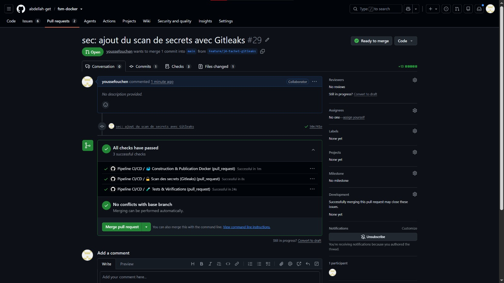
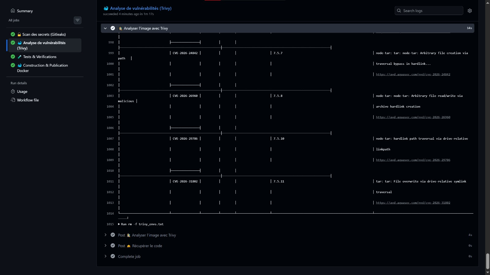

# JOURNAL DE BORD – STAGE Wilance Ouchen Youssef

## Jalon 5 : Déployer automatiquement

**Dates :** 15 Juillet

### Objectif

Mettre en production l'application conteneurisée et sa base de données en s'appuyant sur des plateformes cloud, configurer correctement l'environnement de production et assurer la gestion des accès et des stratégies de retour arrière (rollback).

### Ce que j'ai accompli

- **Mise en place de la stack de production :** Déploiement continu du conteneur Docker contenant l'application Next.js sur **Railway** et hébergement de la base de données PostgreSQL sur **Neon (Neon.tech)** pour la persistance des données.
- **Configuration de l'environnement :** Ajout des variables d'environnement critiques (`DATABASE_URL`, `NEXTAUTH_SECRET`) directement dans les paramètres de Railway.
- **Stratégie de Rollback (Clôture issue #38) :** Définition de la stratégie de retour arrière via l'historique des déploiements de Railway et documentation de la procédure complète dans le fichier `README.md`.
- **Collaboration et revue de code :** Ajout de mon binôme Abdellah sur les espaces de travail Railway et Neon pour faciliter la gestion de l'environnement. Vérification de sa Pull Request et validation (merge) des modifications sur le dépôt principal.
- **Validation de la mise en ligne :** Le site est officiellement en ligne, accessible et totalement fonctionnel.

### Preuves

- **Lien du dépôt :** https://github.com/abdellah-get/fsm-docker.git
- **Lien de l'application en ligne :** fsm-docker-production.up.railway.app/login
- **Captures d'écran :**
  - **Application en ligne sur Railway :** 
  - **Configuration des variables :** 
  - **Base de données sur Neon :** 

### Difficultés rencontrées et solutions

- **Erreur 404 (Not Found) initiale :** L'application affichait une page d'erreur lors de l'accès à l'URL de base publique.
  - _Solution :_ Ajout du chemin `/login` à la fin de l'URL publique, ce qui a permis d'accéder correctement à l'interface d'authentification du portail.
- **Mauvaise détection du port :** Le service Railway était configuré sur le port 8080 par défaut, alors que l'application Next.js nécessite le port 3000.
  - _Solution :_ Ajustement manuel du port via les paramètres réseau de Railway.
- **Problème de connexion (Authentification) :** L'authentification échouait car l'insertion initiale du mot de passe se faisait en clair dans la base de données.
  - _Solution :_ Consultation des logs de déploiement sur Railway pour identifier et récupérer le véritable hash du mot de passe généré par le système. Ce hash a ensuite été intégré manuellement dans la table correspondante de la base de données Neon.

### Questions en attente

- Pas de question pour le moment.

### Temps passé et Prochaines étapes

- **Temps passé :** 7h
- **Prochaine étape :**
  - Entamer le Jalon 6.

# Compte rendu -- 15 Juillet

---

## 1. Réalisations

- **Outils de déploiement (Stack de production) :** Mise en production réussie en s'appuyant sur deux outils principaux :
  - **Railway :** Utilisé pour l'hébergement du conteneur Docker contenant l'application Next.js, permettant un déploiement continu.
  - **Neon (Neon.tech) :** Utilisé pour l'hébergement de la base de données PostgreSQL, assurant la persistance des données.
- **Déploiement et accès :** Le site est officiellement en ligne sur Railway et totalement fonctionnel.
- **Collaboration :** Ajout de mon binôme Abdellah sur les espaces de travail Railway et Neon pour faciliter la gestion de l'environnement de production.
- **Revue de code :** Vérification de la Pull Request de mon binôme et validation (merge) des modifications sur le dépôt.
- **Clôture de la tâche Jalon 5 (#38) :** Définition de la stratégie de rollback (retour arrière) via l'historique des déploiements de Railway, et documentation de la procédure dans le fichier `README.md`.
- **Configuration de l'environnement de production :** Ajout des variables d'environnement critiques sur Railway (`DATABASE_URL`, `NEXTAUTH_SECRET`).

## 2. Difficultés techniques rencontrées et résolues

- **Erreur 404 (Not Found) initiale :** L'application affichait une page d'erreur lors de l'accès à l'URL de base publique. _Résolution :_ Ajout du chemin `/login` à la fin de l'URL publique, ce qui a permis d'accéder correctement à l'interface d'authentification du portail.
- **Mauvaise détection du port :** Le service Railway était configuré sur le port 8080 par défaut, alors que l'application Next.js nécessite le port 3000. _Résolution :_ Ajustement manuel du port via les paramètres réseau de Railway.
- **Problème de connexion (Authentification) :** L'authentification échouait car l'insertion initiale du mot de passe se faisait en clair dans la base de données. _Résolution :_ Consultation des logs de déploiement sur Railway pour identifier et récupérer le véritable hash du mot de passe généré par le système, qui a ensuite été intégré manuellement dans la table correspondante de la base de données Neon.

## 3. Prochaines étapes

- **Préparation du bilan :** Collecter et préparer l'ensemble des captures d'écran nécessaires pour constituer les preuves du bilan final du jalon.
- **Passage de relais :** Donner la main à mon binôme Abdellah afin qu'il puisse prendre en charge et finaliser les autres tâches restantes du jalon. Je reste bien sûr joignable et disponible pour l'épauler ou prendre le relais sur un point spécifique si nécessaire.

## 4. Temps investi

- **Durée totale :** 7 heures

# Compte rendu -- 14 Juillet

## Réalisations:

Je n'ai pas codé aujourd'hui

## Motif:

Engagements personnels impérieux

## Jalon 4 : Sécuriser la chaîne (DevSecOps)

**Dates :** 13 Juillet

### Objectif

Mettre en place des garde-fous de sécurité directement au sein du pipeline d'Intégration Continue (CI/CD) afin d'identifier et de bloquer les failles au plus tôt (approche _Shift Left_) : détection des secrets oubliés et analyse automatique des vulnérabilités de l'image Docker.

### Ce que j'ai accompli

- **Découpage et structuration DevSecOps :** Création des 5 issues associées au Jalon 4 sur GitHub Projects pour planifier l'intégration de la sécurité de manière progressive et sans blocage prématuré.
- **Détection automatisée des secrets (Gitleaks) :** Intégration de l'action `Gitleaks` dans le workflow GitHub Actions (`.github/workflows/ci.yml`). Utilisation de l'option `fetch-depth: 0` pour scanner l'intégralité de l'historique Git et empêcher la fuite de clés API ou de mots de passe.
- **Analyse de l'image Docker (Trivy) :** Intégration de `aquasecurity/trivy-action` dans le pipeline. Configuration d'une construction d'image locale dédiée au scan (`docker build -t fsm-image-local ./web-admin`) afin d'auditer le conteneur avant toute tentative de publication.
- **Génération de rapports lisibles :** Paramétrage d'un affichage des résultats sous forme de tableau ASCII (`format: 'table'`) ciblant uniquement les sévérités critiques et hautes (`severity: 'CRITICAL,HIGH'`).
- **Validation du mode Audit :** Exécution initiale réussie avec `exit-code: '0'` pour valider le bon fonctionnement du scanner et l'affichage du rapport sans bloquer inutilement les développements en cours.
- **Ouverture de la Pull Request :** Soumission des modifications dans une Pull Request dédiée pour validation par l'équipe.

### Preuves

- **Lien du dépôt :** https://github.com/abdellah-get/fsm-docker.git
- Lien de la Pull Request :#30
- **Captures d'écran :**
  - **Scan des secrets (Gitleaks) au vert :** 
  - **Rapport d'analyse d'image (Trivy) :** 

### Difficultés rencontrées et solutions

- **Risque d'omission de secrets dans l'historique :** Par défaut, GitHub Actions ne télécharge que le dernier commit, ce qui pouvait laisser passer un secret introduit puis effacé dans un commit précédent.
  - _Solution :_ Ajout obligatoire du paramètre `fetch-depth: 0` sur le step `actions/checkout` pour forcer le téléchargement et le contrôle de tout l'historique du dépôt.
- **Éviter la "fatigue d'alerte" et les blocages intempestifs :** Bloquer le pipeline dès le premier jour sur toutes les alertes (faibles/moyennes) risquait de paralyser le projet.
  - _Solution :_ Configuration temporaire de Trivy en mode observation (`exit-code: '0'`) et ciblage strict des sévérités `CRITICAL` et `HIGH`.

### Questions en attente

- Pas de question pour le moment

### Temps passé et Prochaines étapes

- **Temps passé :** 4h
- **Prochaine étape :**
  - Entamer le jalon 5 Déployer automatiquement

# Compte rendu -- 13 Juillet

**Période concernée :** 13 Juillet

---

## 1. Réalisations

- **Lancement du Jalon 4 (DevSecOps) :** Découpage du jalon en 5 tâches claires et création des issues associées sur GitHub Projects pour structurer l'intégration de la sécurité dans la chaîne CI/CD.
- **Détection automatisée des secrets :** Intégration de l'outil `Gitleaks` dans le workflow GitHub Actions (`.github/workflows/ci.yml`) avec l'option `fetch-depth: 0` pour analyser l'ensemble de l'historique des commits et empêcher la fuite de clés/mots de passe.
- **Analyse de vulnérabilités Docker :** Intégration de `Trivy` (`aquasecurity/trivy-action`) dans le pipeline CI/CD pour scanner les conteneurs. Configuration d'une construction locale d'image et affichage du rapport de sécurité sous forme de tableau (`format: 'table'`) ciblant les sévérités `CRITICAL` et `HIGH`.
- **Validation du mode Audit & Pull Request :** Exécution réussie du scan Trivy en mode observation (`exit-code: '0'`), confirmant le bon fonctionnement du rapport sans bloquer inutilement le pipeline et ouverture de la Pull Request associée pour intégrer ces fonctionnalités DevSecOps..

## 2. Difficultés techniques rencontrées

- **Analyse incomplète de l'historique par Gitleaks :** Par défaut, GitHub Actions ne télécharge que le dernier commit, risquant de rater des secrets masqués dans les commits précédents. _Solution :_ Ajout du paramètre `fetch-depth: 0` sur le step `actions/checkout` pour forcer le téléchargement de l'historique complet.
- **Risque de blocage prématuré sur Trivy :** Un blocage immédiat (`exit-code: '1'`) aurait pu bloquer le pipeline en raison de failles préexistantes dans l'image de base. _Solution :_ Utilisation temporaire du code de sortie `0` (mode audit) pour vérifier le format des rapports avant de configurer les règles de blocage strictes.

## 3. Prochaines étapes

- **Passage de relais à Abdellah :**
  - Donner la main à mon binôme Abdellah pour vérifier/valider ensemble la fin des configurations et clore officiellement les derniers détails restants.
- **Préparation des preuves :** Capturer l'ensemble des preuves d'exécution pour constituer le bilan du jalon.

## 4. Temps investi

- **Durée totale :** 3 heures

---

## Jalon 3 : Automatiser les tests et la construction

**Dates :** du 12 Juillet au 12 Juillet

### Objectif

Mettre en place un pipeline d'Intégration Continue (CI) automatisé avec GitHub Actions. À chaque modification ou Pull Request, les tests unitaires et la construction de l'image Docker sont exécutés automatiquement pour éviter de fusionner du code cassé.

### Ce que j'ai accompli

- **Mise en place du framework de tests :** Installation et configuration de `Vitest` dans le sous-dossier `web-admin` et ajout du script de lancement `npm run test` dans le `package.json`.
- **Écriture des tests unitaires de base :** Création du premier fichier de test (`src/__tests__/exemple.test.ts`) pour valider la logique de base de l'application hors base de données.
- **Création du Workflow GitHub Actions :** Rédaction du fichier d'intégration continue `.github/workflows/ci.yml` configuré pour se déclencher sur chaque `push` et `pull_request` sur la branche `main`.
- **Enchaînement des étapes CI/CD :** Configuration du pipeline pour exécuter la récupération du code, la gestion du cache `npm`, l'installation des dépendances, le lancement des tests et la construction de l'image Docker.
- **Validation du bouclier CI (Simulation d'échec) :** Introduction volontaire d'un test échoué pour valider que GitHub Actions bloque la fusion, puis correction pour valider le retour au vert.
- **Synchronisation des dépendances :** Résolution des conflits d'installation `npm ci` dans l'environnement CI par l'alignement local de `package-lock.json`.

### Preuves

- **Lien du dépôt :** https://github.com/abdellah-get/fsm-docker.git
- **Lien des Pull Requests :**
  - PR #22
- **Captures d'écran :**
  - **Capture d'un échec de test (Blocage CI) :** 
  - **Capture de la correction et du succès (Coche verte) :** 

### Difficultés rencontrées et solutions

- **Plantage d'installation `npm ci` dans le runner GitHub :**
  - _Solution :_ Exécution de `npm install` dans `web-admin` pour synchroniser parfaitement `package.json` et `package-lock.json`, et ajustement du workflow avec `npm install`.
- **Conflits de fichiers Git lors des changements de branches (`Journal_Youssef.md`) :**
  - _Solution :_ Utilisation de `git reset --hard HEAD` pour nettoyer l'index local et repartir d'un état propre sur la branche principale.

### Questions en attente

- Pas de question

### Temps passé et Prochaines étapes

- **Temps passé :** 4h
- **Prochaine étape :**
  - Contacter mon binôme Abdellah
    - vérifier et finaliser les permissions d'accès au registre GitHub Container Registry (GHCR).
    - Intégrer le badge de statut dans le `README.md` principal.
  - Entamer Jalon 4. Sécuriser la chaîne (DevSecOps)

# Compte rendu -- 12 Juillet

**Période concernée :** 12 Juillet

---

## 1. Réalisations

- **Mise en place des tests unitaires (Tâche #15) :** Installation de `Vitest` dans le dossier `web-admin`, configuration du script `npm run test`, et création d'une suite de tests de base (`src/__tests__/exemple.test.ts`) pour valider l'environnement.
- **Automatisation CI (Tâche #16) :** Création du workflow GitHub Actions (`.github/workflows/ci.yml`) configuré pour déclencher automatiquement les tests et la construction de l'image Docker à chaque push ou pull request.
- **Validation et robustesse de la CI (Tâche #17) :** Simulation d'un échec de test (volontaire) pour vérifier que GitHub bloque la fusion du code, suivi de la correction et de la validation (coche verte).
- **Synchronisation des dépendances :** Résolution du blocage `npm ci` dans le pipeline par l'utilisation de `npm install` et la synchronisation du fichier `package-lock.json`.

## 2. Difficultés techniques rencontrées

- **Désynchronisation `npm ci` :** Le pipeline GitHub Actions a échoué initialement car le fichier `package-lock.json` était en conflit avec le `package.json` lors de l'installation automatisée. _Solution :_ Mise à jour locale via `npm install` pour aligner les fichiers et modification du workflow pour utiliser `npm install`.
- **Conflits de fusion git :** Tentative de changement de branche bloquée par des fichiers non fusionnés (`Journal_Youssef.md`). _Solution :_ Utilisation de `git reset --hard HEAD` pour nettoyer l'index et repartir sur une base propre.

## 3. Prochaines étapes

- **Finaliser le Jalon 3 :**
  - Contacter mon binôme Abdellah pour finaliser ensemble les derniers points du Jalon 3 .
  - Finaliser la documentation des preuves (captures d'écran) pour le bilan du jalon 3.

## 4. Temps investi

- **Durée totale :** 3 heures

## Jalon 2 : Mettre l'application dans des conteneurs

**Dates :** du 08 Juillet au 11 Juillet

### Objectif

Empaqueter l'application web (Next.js) et sa base de données (PostgreSQL) dans des conteneurs Docker isolés, optimiser l'image de production, et orchestrer le lancement complet via Docker Compose tout en se détachant du service cloud Supabase au profit d'une infrastructure 100% locale.

### Ce que j'ai accompli

- **Création du Dockerfile optimisé :** Mise en place d'un build multi-étapes avec l'image `node:20-alpine` et activation du mode "standalone" de Next.js pour produire une image ultra-légère. Création du fichier `.dockerignore`.
- **Orchestration Docker Compose :** Configuration du fichier `docker-compose.yml` pour lancer simultanément les conteneurs `web-admin` et `db`. Mise en place d'un volume pour la persistance des données et des variables d'environnement (`DATABASE_URL`).
- **Intégration et Déploiement Local :** Fusion de ma branche avec celle de mon binôme (Abdellah) contenant la base de données PostgreSQL. Initialisation manuelle du premier profil utilisateur rattaché à une entreprise via DBeaver (sur le port 5433).
- **Migration de l'architecture (Retrait de Supabase) :** Suppression progressive des traces de Supabase (anciens clients, middleware, imports) et validation de la nouvelle connexion backend locale via le succès de la route de test `/api/test-db`.
- **Résolution des dépendances de compilation :** Ajustement du `Dockerfile` en remplaçant la commande stricte `npm ci` par `npm install` pour débloquer le build de l'image.

### Preuves

- **Lien du dépôt :** https://github.com/abdellah-get/fsm-docker.git
- **Lien de la Pull Request :** #21
- **Commande de démonstration :** `docker compose up -d --build`

### Difficultés rencontrées et solutions

- **Complexité de l'intégration Docker/Supabase :** Cela nous a bloqués (le 09 Juillet) et poussés à remplacer l'API distante par une base PostgreSQL locale.
- **Erreurs réseau des conteneurs :** L'application tentait de pointer vers `localhost` au lieu du conteneur DB. _Solution :_ Remplacement par le nom du service (`db`) dans `src/lib/db.ts` et dans les variables d'environnement.
- **Conflit de persistance des données :** Les nouveaux identifiants n'étaient pas reconnus à cause d'un ancien cache Docker. _Solution :_ Purge totale via la commande `docker compose down -v`.
- **Crashs des pages (Erreur 500) et modules manquants :** Plantage du middleware et de la page `/login` dû à l'absence de Supabase. _Solution :_ Nettoyage du code, installation manuelle des pilotes `pg` / `@types/pg` (Erreur ts 2307), et ajout du nouveau système d'authentification `next-auth/react` (Erreur ts 2305).
- **Blocage de la compilation Docker (`npm ci`) :** La désynchronisation entre `package.json` et `package-lock.json` faisait échouer le build. _Solution :_ Passage à `npm install` dans le Dockerfile.

### Questions en attente

- Aucune pour le moment.

### Temps passé et Prochaines étapes

- **Temps passé :** 10 heures.
- **Prochaines étapes :** passer la main à Abdellah pour finaliser le câblage de NextAuth, vérifier toutes les interfaces (Login, Dashboard) et préparer les captures finales, puis je vais entamer le Jalon 3 (Intégration continue / GitHub Actions).

---

# Compte rendu -- 11 Juillet

**Période concernée :** 11 Juillet

---

## 1. Réalisations

- **Intégration du travail en binôme :** Récupération du travail d'Abdellah (mise en place de la base de données PostgreSQL locale) et fusion réussie de sa branche avec ma branche `jalon2`.
- **Initialisation de la base de données :** Suivi des procédures du `README.md` fraîchement rédigé, incluant la connexion via DBeaver sur le port 5433 et l'injection manuelle en SQL du premier profil utilisateur (Gérant/Technicien) rattaché à une entreprise.
- **Nettoyage de l'architecture :** Suppression progressive des traces de Supabase (anciens clients, middleware, imports) devenues obsolètes suite à la transition vers la base de données locale.
- \*\*Modifier le `Dockerfile` (passer de `npm ci` à `npm install`) pour débloquer la compilation de l'image..

## 2. Difficultés techniques rencontrées

- **Dépendances et typage TypeScript :** L'ajout du nouveau système d'authentification a généré des erreurs de modules introuvables (`next-auth/react` non installé initialement) et des fonctions d'actions SQL manquantes (`ts(2305)`).
- **Blocage de compilation Docker :** La commande stricte `npm ci` dans le Dockerfile a fait échouer le build à cause d'une désynchronisation entre `package.json` et `package-lock.json` suite à l'ajout des nouveaux paquets.

## 3. Prochaines étapes

- **Finaliser le Jalon 2 :**
- Conteneurisation (Build) : Lancement de la construction de la nouvelle image Docker (`docker compose up -d --build`) intégrant la fusion de nos deux travaux
- Optimiser la taille de l'image Docker finale (multi-stage build, mode standalone) pour garantir un déploiement plus léger et performant.
- Vérifier que toutes les interfaces (Login, Dashboard) communiquent parfaitement avec le conteneur de la base de données sans aucune erreur.
- Partager le travail validé et conteneurisé via une **Pull Request**.
- Préparer les captures d'écran et la documentation pour le **bilan final du Jalon 2** avec notre encadrant.

## 4. Temps investi

- **Durée totale :** 4 heures

# Compte rendu -- 10 Juillet

**Période concernée :** 10 Juillet

---

## 1. Réalisations

- **Fusion des branches :** Intégration de la branche d'Abdellah (qui a remplacé l'API Supabase distante par une base de données locale PostgreSQL) avec ma branche principale.
- **Conteneurisation de l'application Next.js (Field Service Management) :**
  - Finalisation d'un **Dockerfile multi-étapes** optimisé pour la production.
  - Utilisation d'une image de base légère `node:20-alpine`.
  - Activation du mode **standalone** de Next.js, permettant de produire une image ultra-légère (sans les dépendances de développement inutiles).
- **Orchestration avec Docker Compose :**
  - Mise à jour du fichier `docker-compose.yml` pour lancer simultanément et relier le conteneur de l'application web (`web-admin`) et le conteneur de la base de données (`db`).
  - Configuration des variables d'environnement (`DATABASE_URL`) pour permettre la communication native entre les conteneurs.
  - Configuration du volume pour la persistance des données PostgreSQL.
- **Validation backend :** Mise en place et succès de la route de test `/api/test-db` confirmant que le conteneur web parvient bien à lire les données du conteneur de la base de données.

## 2. Difficultés techniques rencontrées

Plusieurs problèmes bloquants ont empêché le site de fonctionner directement en `localhost` lors du déploiement des conteneurs :

- **Erreur 500 (Internal Server Error) au démarrage :** Le middleware de Next.js faisait crasher l'application car il tentait d'initialiser un client Supabase avec des clés d'API manquantes.
- **Erreur réseau de conteneurs (`localhost` vs `db`) :** L'application tentait de se connecter à PostgreSQL via l'hôte `localhost`. Dans Docker, `localhost` pointe vers le conteneur web lui-même. Il a fallu modifier le code (`src/lib/db.ts`) et le `docker-compose.yml` pour utiliser le nom du service (`db`) comme hôte.
- **Absence du pilote de base de données (Erreur ts 2307) :** L'abandon de Supabase nécessitait l'utilisation d'un client SQL classique. Il a fallu installer manuellement les paquets `pg` et `@types/pg` pour que Node.js puisse communiquer avec Postgres.
- **Conflit de persistance (Ancien volume) :** Les nouveaux identifiants de base de données n'étaient pas pris en compte car Docker utilisait un ancien volume en cache. Une purge totale (`docker compose down -v`) a été nécessaire pour forcer l'initialisation avec les bons identifiants.
- **Plantage actuel de la page `/login` :** Le frontend crash ("This page couldn't load") car le code de la page d'authentification dépend toujours des fonctions natives de `supabase.auth`, qui ne sont plus disponibles.

## 3. Prochaines étapes

- **Résoudre les erreurs frontend :** Nettoyer le code lié à Supabase dans les composants de l'interface (notamment la page `/login` et le système de session) pour que le site s'affiche correctement en local sans crasher.
- **Adapter l'authentification :** Réécrire la logique de connexion pour qu'elle s'appuie directement sur notre base PostgreSQL locale (au lieu du service d'authentification de Supabase).

## 4. Temps investi

- **Durée totale :** 4 heures

# Compte rendu -- 09 Juillet

## ce que j'ai fait:

Je n'ai pas codé ni produit de livrable direct aujourd'hui

## ce qui me bloque :

La complexité de l'intégration de Supabase avec Docker

# Compte rendu -- 08 Juillet

**Période concernée :** 08 Juillet

---

## 1. Réalisations

- Optimisation du **Dockerfile** de l'application Next.js (Field Service Management) pour la production :
  - Mise en place d'un **build multi‑étapes** (séparation construction / exécution).
  - Utilisation d'une image de base `node:20-alpine` pour réduire la taille.
  - Limitation des dépendances installées (`npm ci --only=production`) dans l'image finale.
  - Activation du mode **standalone** de Next.js pour une image encore plus légère (< 100 Mo).
- Création et enrichissement du fichier **`.dockerignore`** pour exclure `node_modules`, `.next`, `.env`, et les fichiers inutiles du contexte de build.
- Mise à jour du fichier **`docker-compose.yml`** :

## 2. Difficultés techniques rencontrées

- **Aucune difficulté technique notable pour le moment.**  
  Les modifications apportées (Dockerfile, .dockerignore, docker-compose) se sont déroulées sans erreur bloquante.

## 3. Prochaines étapes

- **Construire l’image Docker de production** à l’aide du Dockerfile optimisé (`docker build -t fsm-app:light .`).
- **Lancer l’environnement complet** avec `docker compose up` pour valider le dialogue entre les services (app + base de données).
- Partager le travail avec mon binôme Abdellah via une **Pull Request**.
- Préparer le **bilan du Jalon 2** pour notre encadrant.

## 4. Temps investi

- **Durée totale :** 3 heures.

---

# Bilan du Jalon 1 : Fondations Git et qualité du code

**Période :** du 07 Juillet au 08 Juillet

## Objectif

Mettre en place un environnement de développement collaboratif avec Git,
préparer une base de projet propre et intégrer un contrôle de la qualité
du code.

## Réalisations

- Création d'une route `/api/health` fonctionnelle.
- Mise à jour du `README.md` avec les étapes de lancement via Docker.
- Vérification du `.gitignore`.
- Configuration et exécution d'ESLint.
- Respect du Git Flow avec un développement sur une branche dédiée.

## Preuves

- Dépôt GitHub : https://github.com/abdellah-get/fsm-docker.git
- Pull Request : #11
- Capture d'écran du GitHub Board transmise à l'encadrant.

## Critères validés

- Aucun push direct sur `main`.
- Historique des commits clair.
- Projet lançable en suivant le `README`.
- Tableau de bord mis à jour.

## Difficultés rencontrées et solutions

- VS Code affichait une erreur liée aux types de Next.js
  (`Cannot find module 'next/server'`). Le problème a été résolu après
  l'installation des dépendances avec `npm install` et le redémarrage
  du serveur TypeScript.
- ESLint a détecté plusieurs erreurs fréquentes (imports inutilisés,
  variables non utilisées et problèmes de mise en forme). Une
  correction automatique suivie d'une vérification manuelle a permis
  de résoudre ces points.

## Questions en attente

Aucune.

## Temps passé et prochaines étapes

**Temps passé :** 3h

La prochaine étape consiste à préparer les tâches du **Jalon 2**, les
ajouter au GitHub Board et commencer le développement sur une nouvelle
branche.

---

# Compte rendu -- 07 Juillet

## Ce que j'ai fait

J'ai bien avancé sur le **Jalon 1** en travaillant sur une branche
dédiée (`feat/jalon1`) selon le Git Flow. J'ai développé une
route API `/health` avec Next.js, vérifié le contenu du `.gitignore`
afin d'éviter le versionnement de fichiers sensibles, puis amélioré le
`README.md` pour faciliter le lancement du projet avec Docker. Enfin,
j'ai ouvert une Pull Request pour proposer mes modifications.

## Ce qui me bloque

Aucun blocage majeur. En revanche, ESLint a signalé plusieurs problèmes
courants dans le projet existant, notamment des variables déclarées mais
inutilisées, des imports non utilisés et quelques avertissements liés au
formatage du code. Un nettoyage est nécessaire avant de finaliser le
jalon.

## Ce que je vais faire ensuite

Corriger les remarques d'ESLint (avec `--fix` lorsque c'est possible),
ajouter un commit de correction sur ma branche, puis demander à mon
binôme de relire et valider la Pull Request.

**Temps passé :** 2h

---

# Journal de Bord – Jalon 0 (Période du 05 au 06 Juillet)

## 1. Objectif du sprint

Préparer le socle technique et organisationnel : configuration des environnements, définition des rituels d'équipe et sélection de l'application support du projet (fil rouge).

## 2. Travaux réalisés

- **Environnement de développement** : Installation et paramétrage de Git et VS Code.
- **Application cible** : Choix et initialisation d'une application web Next.js. Le code est versionné sur GitHub et pleinement opérationnel en local via Docker.

## 3. Preuves et critères de validation

- **Dépôt source** : [https://github.com/abdellah-get/fsm-docker.git](https://github.com/abdellah-get/fsm-docker.git)

## 4. Incidents techniques et correctifs

| Problème rencontré                | Solution apportée                                                     |
| :-------------------------------- | :-------------------------------------------------------------------- |
| Échec de connexion à l'API Docker | Redémarrage de Docker Desktop.                                        |
| Conflit avec un ancien conteneur  | Nettoyage des ressources via la commande `docker-compose down`.       |
| Git non détecté dans VS Code      | Réouverture du projet depuis le bon répertoire racine (`fsm-docker`). |

## 5. Points d'attention et questions en suspens

Aucun blocage ou question ouverte à ce stade.

## 6. Temps investi et prochaines étapes

- **Charge estimée** : 3 heures.

## Prochaines étapes

- **Suite du planning** : Démarrage du Jalon 1 avec mon binôme en respectant notre système de Pull Requests.

---

**Période concernée :** 06 Juillet

---

## 1. Réalisations

- Finalisation complète du **Jalon 0**.
- Configuration de l'espace de travail sous **VS Code** et synchronisation avec **GitHub**.
- Prise d'avance sur le planning : conteneurisation réussie de l'application **Next.js** à l'aide de **Docker** et **Docker Compose**.

## 2. Difficultés techniques rencontrées

Les points suivants ont constitué des freins temporaires au cours de la session :

| Problème rencontré           | Description                                                                                                  |
| :--------------------------- | :----------------------------------------------------------------------------------------------------------- |
| **Conflit de conteneur**     | Un ancien conteneur était toujours actif et entrait en conflit avec la nouvelle instance.                    |
| **Erreur de dossier racine** | Un mauvais paramétrage du dossier racine dans VS Code a perturbé l'exécution des commandes Git et du projet. |

## 3. Prochaines étapes

- Ouvrir une **Pull Request** pour permettre à mon binôme (Abdellah) de consulter et valider le travail effectué.
- Transmettre le **bilan de fin de Jalon 0** à notre encadrant.

## 4. Temps investi

- **Durée totale :** 3 heures.

| Problème rencontré           | Description                                                                                                  |
| :--------------------------- | :----------------------------------------------------------------------------------------------------------- |
| **Conflit de conteneur**     | Un ancien conteneur était toujours actif et entrait en conflit avec la nouvelle instance.                    |
| **Erreur de dossier racine** | Un mauvais paramétrage du dossier racine dans VS Code a perturbé l'exécution des commandes Git et du projet. |

## 3. Prochaines étapes

- Ouvrir une **Pull Request** pour permettre à mon binôme Abdellah de consulter et valider le travail effectué.
- Transmettre le **bilan de fin de Jalon 0** à notre encadrant.

## 4. Temps investi

- **Durée totale :** 3 heures.
