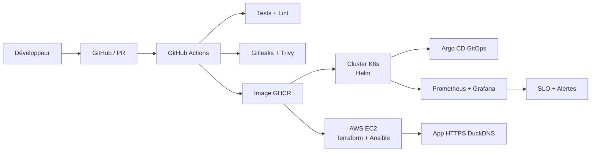

# FSM Docker — Stage DevOps (Wilance)

[](https://github.com/abdellah-get/fsm-docker/actions/workflows/ci.yml)

Application fil rouge **Field Service Management (FSM)** utilisée pour construire une chaîne DevOps complète : Git → CI/CD → conteneurs → cloud AWS → Kubernetes → GitOps → observabilité.

**Binôme :** Abdellah ANECLOUB & Youssef Ouchen  
**Dépôt :** [abdellah-get/fsm-docker](https://github.com/abdellah-get/fsm-docker)  
**Démo web (EC2) :** [https://fsm-app-morocco.duckdns.org/login](https://fsm-app-morocco.duckdns.org/login)

---

## Présentation

`web-admin` est une application **Next.js** de gestion d’interventions techniques, connectée à une base **PostgreSQL** (Supabase/Neon en cloud, Postgres local via Docker).

L’objectif du stage n’est pas le produit lui-même, mais la **chaîne autour** : qualité, sécurité, déploiement automatisé, infrastructure as code, orchestration et monitoring.

---

## Architecture

Schéma de la chaîne DevOps (rendu automatiquement par GitHub) :



---

## Stack

| Domaine | Technologies |
|---|---|
| Application | Next.js, PostgreSQL, NextAuth |
| Conteneurs | Docker, Docker Compose |
| CI/CD | GitHub Actions, GHCR |
| Sécurité | Gitleaks, Trivy |
| Cloud / IaC | AWS EC2, Terraform, Ansible, DuckDNS + HTTPS |
| Orchestration | Kubernetes (kind/k3d), Helm |
| GitOps | Argo CD |
| Observabilité | Prometheus, Grafana, ServiceMonitor, PrometheusRule |

---

## Jalons réalisés

| Jalon | Thème | Statut |
|---|---|---|
| 0 | Cadrage & environnement | Fait |
| 1 | Git, PR, qualité | Fait |
| 2 | Docker / Compose | Fait |
| 3 | CI (tests + build image) | Fait |
| 4 | DevSecOps (Trivy, Gitleaks) | Fait |
| 5 | Déploiement automatique | Fait |
| 6 | IaC (Terraform + Ansible) | Fait |
| 7 | Kubernetes | Fait |
| 8 | Helm | Fait |
| 9 | GitOps (Argo CD) | Fait |
| 10 | Observabilité (Prometheus / Grafana / SLO) | Fait |
| Final | Synthèse, doc, soutenance | En cours |

---

## Structure du dépôt

```text
fsm-docker/
├── web-admin/           # Application Next.js
├── fsm-app/             # Chart Helm de l'application
├── k8s/                 # Manifestes K8s (ServiceMonitor, alertes, exemples)
├── argocd-apps/         # Applications Argo CD
├── captures/            # Preuves des jalons
├── .github/workflows/   # Pipeline CI/CD
├── docker-compose.yml   # Stack locale app + DB
├── JOURNAL_Abdellah.md  # Journal de bord
└── JOURNAL_Youssef.md
```

---

## Démarrage rapide (local)

### Prérequis
- Node.js, Docker Desktop, Git

### 1. Base + application
```bash
docker compose up -d --build
```
- App : [http://localhost:3001](http://localhost:3001)  
- Postgres local : port `5433`

### 2. Variables
- Copier `.env.example` → `.env` (racine / compose selon besoin)
- Configurer `web-admin/.env.local` (non versionné)

### 3. Dev sans Compose (optionnel)
```bash
cd web-admin
npm install
npm run dev -- -p 3009
```

### 4. Tests
```bash
cd web-admin
npm test
```

### 5. Santé & métriques
```bash
curl.exe http://localhost:3009/api/health
curl.exe http://localhost:3009/api/metrics
```

---

## CI/CD

Workflow : [`.github/workflows/ci.yml`](./.github/workflows/ci.yml)

À chaque PR / push sur `main` :
1. Installation dépendances + cache
2. Tests
3. Scan secrets (Gitleaks)
4. Build image + scan Trivy
5. Publication GHCR sur `main` : `ghcr.io/abdellah-get/fsm-docker`

Tout passe par **Pull Request** (pas de push direct sur `main`).

---

## Déploiement

### AWS EC2 (jalons 5–6)
- Provisionnement Terraform (EC2 + security group)
- Configuration / déploiement Ansible
- Domaine : `fsm-app-morocco.duckdns.org` (HTTPS)

### Kubernetes + Helm + GitOps (jalons 7–9)
- Chart : `fsm-app/`
- Application Argo CD : `argocd-apps/app-fsm.yaml`
- Namespace applicatif : `jalon9`
- Sync automatique + self-heal

### Secrets
Les secrets **ne sont pas** commités.
- Exemple Helm : `fsm-app/values-secret.yaml.example`
- Fichier local gitignoré : `fsm-app/values-secret.yaml`
- Exemple K8s : `k8s/secret.example.yaml`

---

## Observabilité (jalon 10)

- Route applicative : `/api/metrics`
- ServiceMonitor : `k8s/fsm-app-monitor.yaml` (`path: /api/metrics`)
- Dashboard Grafana : `FSM App - Jalon 10` (trafic, latence p95, erreurs 5xx)
- SLO : p95 des requêtes HTTP &lt; 1s
- Alerte : `FsmAppHighLatency` (`k8s/fsm-app-alerts.yaml`)

Preuves : dossier [`captures/`](./captures/) (`jalon10-*.png`).

---

## Journaux de bord

- [JOURNAL_Abdellah.md](./JOURNAL_Abdellah.md)
- [JOURNAL_Youssef.md](./JOURNAL_Youssef.md)

---

## Créer un compte en local (rappel)

1. Lancer Compose (DB sur le port **5433**)
2. Récupérer l’`entreprise_id` en SQL
3. Insérer un utilisateur avec un hash bcrypt
4. Se connecter sur `/login`

Hash d’exemple pour le mot de passe `123456` :
```text
$2b$10$5EuJ2Y48Rl3ecEvc8Mvcu.NWrBsHCiYEE8Fa51qEjoAxQMuZ888Hi
```

---

## Soutenance — jalon final

Livrables attendus :
- [x] Dépôt nettoyé (secrets hors Git, artefacts lourds retirés)
- [x] README général + schéma d’architecture
- [ ] Démonstration bout en bout (commit → app surveillée)
- [ ] Diapositives 8–12
- [ ] Bilan jalon final + validation tuteur
